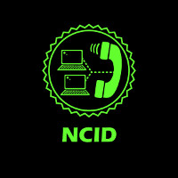

## 
 NCID - Net Caller ID Documentation

Author: The NCID Project
  

Last Edited: Tue Dec 31, 2013

Copyright: 2013

NCID documentation includes information on how to get started,
information on configuring modems, information on configuring
gateways, devices supported, and how to install NCID for the
various operating systems supported.

It also includes some troubleshooting information, an FAQ. and
a TODO.

###  Table of Contents

> [Getting Started](#getstarted_top)  
> [Devices Supported](#devices_top)  
> [Modems](#modems_top)  
> [Gateways](#gateways_top)  
> [FAQ](#faq_top)  
> [INSTALL (generic)](#instl_generic_top)    
> [INSTALL-Cygwin](#instl_cygwin_top)  
> [INSTALL-Fedora](#instl_fed_top)  
> [INSTALL-FreeBSD](#instl_free_top)  
> [INSTALL-Mac](#instl_mac_top)  
> [INSTALL-Raspbian](#instl_rasp_top)  
> [INSTALL-Redhat](#instl_red_top)  
> [INSTALL-TiVo](#instl_tivo_top)  
> [INSTALL-Ubuntu](#instl_ubuntu_top)  
> [INSTALL-Win](#instl_win_top)  
> [Verbose Levels](#verbose_top)  
> [Contributors](#contrib_top)  
> [TODO](#todo_top)  
